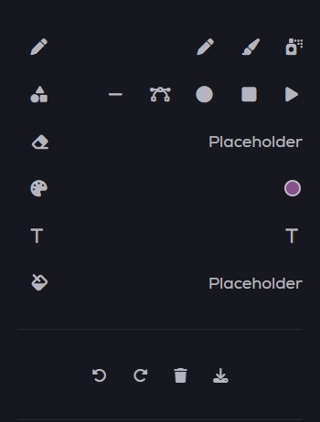

********   Canvas for the creative  *******

**Section 1 - What this project does**

This is the proejct to showcase what we have learnt Javascript using class, inheritance, coordinates and other functions.

**Section 2 - Challenges**

The challenges we face is the modification of the side bar, where some of the formatting is not easy to change to what we wanted.
The difference between canvas-draft and canvas-real also baffled us as it's not requried to be used in pen tool.
Adding the color palette was a changllenge because we trialed many ways find a place the palette.
Time constraint is also a major issue, there is just too many features we want to add. 

**Section 3 - How to use the site**

Just load up canvas.html and let your imagination run wild.

List of functions are:

Draw:
1. Line Tool
2. Brush Tool
3. Spray Tool
4. Straight Line Tool
5. Bezier Tool 
6. Circle Tool
7. Rectangle Tool
8. Triangle Tool
10. Text box for input

Edit:
1. Eraser
2. Undo
3. Clear
4. Reset 

  
 **Section 4 - Credit**
 This project is done by Lauris Kwan and Sam Yip

